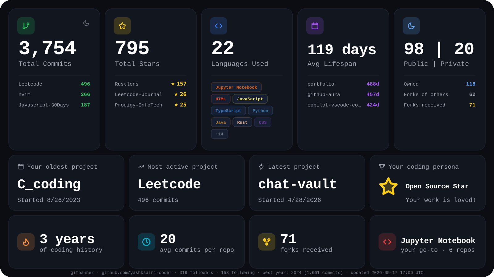

# GitBanner

[](https://github.com/yashksaini-coder/GitBanner/releases)
[](https://github.com/marketplace/actions/gitbanner-profile-card)

A GitHub Action that renders a personalized stats banner (SVG + PNG) for your profile README — total commits, stars, language distribution, project highlights, and your coding persona.

Inspired by the [githubtimeline.com](https://githubtimeline.com) layout.



## Quick start

1. Create a repo named `<your-username>/<your-username>` (the GitHub profile repo).
2. Create a Personal Access Token (classic or fine-grained) with these scopes:
   - `read:user` (always required)
   - `repo` (only if you want to set `include-private: true`)

   Save it as a repository secret named `GITBANNER_PAT`.
   Tokens: <https://github.com/settings/tokens>

3. Add this workflow at `.github/workflows/gitbanner.yml`:

```yaml
name: Refresh GitBanner
on:
  schedule:
    - cron: '0 6 * * 0'   # every Sunday at 06:00 UTC
  workflow_dispatch:
jobs:
  refresh:
    runs-on: ubuntu-latest
    permissions:
      contents: write
    steps:
      - uses: actions/checkout@v4
      - uses: yashksaini-coder/GitBanner@v1
        with:
          github-token: ${{ secrets.GITBANNER_PAT }}
```

4. Embed the banner in your profile README:

```markdown

```

### Pin to a commit SHA for stricter supply-chain safety

`@v1` floats to the latest patch in the v1 series. For full immutability, pin to a commit SHA:

```yaml
- uses: yashksaini-coder/GitBanner@<full-sha>
```

You can find the SHA for a release on the [releases page](https://github.com/yashksaini-coder/GitBanner/releases).

## Inputs

| Input | Default | Description |
|---|---|---|
| `github-token` | _(required)_ | PAT with `read:user` (and `repo` if `include-private` is true). |
| `username` | repo owner | GitHub login to render. |
| `theme` | `dark` | Theme name. Currently only `dark` ships in v1. |
| `format` | `both` | `svg`, `png`, or `both`. |
| `output-path` | `gitbanner` | Output path without extension. |
| `include-private` | `false` | Include private repo stats. Requires `repo` scope. |
| `exclude` | _(empty)_ | Comma-separated repos to exclude from per-repo aggregations. The profile README repo is always excluded automatically. Does not affect the `Total Contributions` headline (which is derived from GitHub's contribution-graph API). |
| `ignore-languages` | _(empty)_ | Comma-separated language names to drop from the **Languages Used** count, the top-languages list, and the **Go-to language** pick. Matched case-insensitively. Useful for hiding auto-generated content like `Jupyter Notebook` outputs or vendored code. |
| `commit` | `true` | When true, commit and push the regenerated card if it changed. |
| `commit-message` | `chore: refresh GitBanner stats` | Commit message used by the action. |

## Outputs

| Output | Description |
|---|---|
| `card-path` | Filesystem path of the primary generated card. |

## Runner platforms

The bundled action ships native `@resvg/resvg-js` binaries for **Linux x64 (gnu + musl)**.

- For PNG output, use `runs-on: ubuntu-latest`.
- SVG-only output (`format: svg`) works on any runner platform.
- macOS / Windows runners with `format: png` or `format: both` will fail.

## Troubleshooting

### `Resource not accessible by integration`

You're using `${{ secrets.GITHUB_TOKEN }}` instead of a PAT. The built-in
`GITHUB_TOKEN` does not have access to the GraphQL endpoints this action
uses for cross-repo stats. Create a PAT with `read:user` and save it as
`GITBANNER_PAT` (or similar) repo secret.

### The headline `Total Contributions` looks low

The headline is `commits + issues + PRs + reviews + restricted` derived from
GitHub's contribution-graph API. The **commits** portion only counts commits
made on the **default branch or `gh-pages` branch** of repos you have
committed to, where the commit's author email is verified against your
GitHub account. Commits authored before email verification or on non-default
branches don't appear.

For a full breakdown of how the number is computed, run
`npm run inspect -- --user <login>` locally — see [CLI commands](#cli-commands).

### The action fails with `Unrecognized named-value: 'github'`

You're consuming a version `<v1.0.0` (development snapshot). Pin to `@v1`.

### `dist/ is out of sync`

If you're forking and building, run `npm run build` and commit the result.
The action runs `dist/index.js` directly — there's no install step at runtime.

## Security

- This action requires a Personal Access Token. Treat it like any other
  long-lived credential: rotate periodically, and store only as a
  repository secret.
- **Token scopes** (classic PAT) or **permissions** (fine-grained PAT):
  - Always: `read:user` (classic) or *Account: Profile — Read-only* (fine-grained)
  - Only if `include-private: true`: add `repo` scope or grant repository
    access in the fine-grained PAT
- **Fine-grained PAT repository access:** the action queries
  `user.repositories(ownerAffiliations: [OWNER])` to compute stats and
  language distribution across *all* your owned repos. A token scoped to
  just the profile repo will return an empty repository list, producing a
  banner with zeroed stats. Grant the token access to **all repositories
  whose stats should appear on the banner** (typically "All repositories",
  or every owned repo).
- The action commits and pushes to your profile repo by default. Set
  `commit: false` if you'd rather do the commit yourself.

## Local development

See [CONTRIBUTING.md](./CONTRIBUTING.md) for setup and the PR process.

## CLI commands

Two CLIs ship in the source tree for local use. Both load a `GH_PAT` from
`.env` (see `.env.example`) when a `--token` isn't passed explicitly.

### `npm run dev` — render a banner locally

Generates an SVG/PNG card and writes it to disk. Same code path the action
uses on GitHub Actions, just driven from your terminal.

```bash
# Render against a live profile
npm run dev -- --user <login> --include-private

# Render from a fixture (no API call — useful when iterating on layout)
npm run dev -- --fixture tests/fixtures/raw.json --output out/preview

# SVG only (faster, works on any platform)
npm run dev -- --user <login> --format svg
```

Flags: `-u/--user`, `-t/--token`, `-o/--output` (path without extension),
`--theme`, `--format` (`svg`/`png`/`both`), `-f/--fixture`,
`--include-private`, `--exclude <comma-list>`,
`--ignore-languages <comma-list>`. Full list via `--help`.

### `npm run inspect` — print all stats, no image render

Diagnostic command that shows what the banner *would* show, plus the full
contribution-graph breakdown, per-year activity, per-repo commit
distribution, portfolio stats, and consistency checks. Use this whenever
a banner number looks wrong, or before adding/changing a metric.

```bash
# Full report
npm run inspect -- --user <login> --include-private

# Headline summary only
npm run inspect -- --user <login> --quiet

# Show the top 50 repos in the per-repo breakdown (default is 30)
npm run inspect -- --user <login> --top 50

# Offline against a fixture
npm run inspect -- --fixture tests/fixtures/raw.json

# Machine-readable JSON, pipeable to jq
npm run --silent inspect -- --user <login> --json \
  | jq '.stats | {totalContributions, totalCommits, yearsCoding, persona: .persona.label}'
```

Flags: `-u/--user`, `-t/--token`, `-f/--fixture`, `--include-private`,
`-x/--exclude <list>`, `--ignore-languages <list>`, `-n/--top <N>`,
`--json`, `-q/--quiet`. Full list via `--help`.

### Other scripts

| Script | Purpose |
|---|---|
| `npm test` | Vitest suite (currently 37 tests) |
| `npm run typecheck` | TypeScript without emit |
| `npm run build` | Bundle `src/` → `dist/index.js` via `ncc`, then inject the ESM shim |

## What it shows

- **Row 1** — total contributions (commits + issues + PRs + reviews + restricted), total stars, languages used (with pills), avg repo lifespan, public/private split.
- **Row 2** — your oldest project, most active project, latest project, and computed coding persona (e.g. *Open Source Star*, *Polyglot*, *Veteran*, *Builder*, …).
- **Row 3** — years coding (years with at least one contribution), average commits per repo, your go-to language.
- **Footer** — followers/following, best year, and `updated YYYY-MM-DD HH:MM UTC`.

## License

[MIT](./LICENSE)
